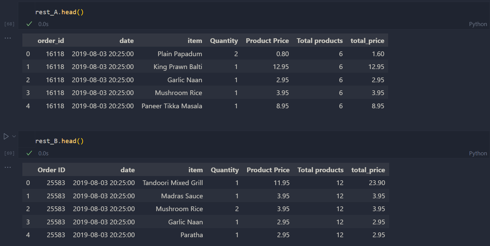

# Takeout Sales Dashboard Project

## Introduction
Welcome to the Takeout Sales Dashboard repository! 

Understanding sales data is crucial for businesses to optimize their strategies and drive growth. Data-driven decisions are essential to optimize efficiency and increase revenue for any business. 

This project analyzes real-world sales data to uncover key insights and trends, leveraging a combination of Python, SQL, and Tableau. The goal is to demonstrate end-to-end data analysis skills, from data preprocessing and cleaning to advanced visualizations.


## Dataset
This dataset contains roughly **200k rows of data**, across **~33k orders** from **two** Indian takeout restaurants in London, UK.

Dataset Link (Kaggle): https://www.kaggle.com/datasets/henslersoftware/19560-indian-takeaway-orders

Here is a sample of the cleaned datasets (see ```takeout.ipynb```): 


## Tools Used
- Python (download dataset, data cleaning)
    - pandas, Kaggle API
    - see ```takeout.ipynb```.
- SQL (Aggregate Statistics, ```JOIN```ing tables)
    - MySQL
    - see 
- Tableau (Creating/Uploading Visualizations)
    - Tableau Public
    -

## SQL
- Files in ```sql``` folder:
    - ```sql/build_schema.sql```: define database schema, create tables + structure
    -  ```sql/import_data.sql```: 
    - ```query_results```:  
